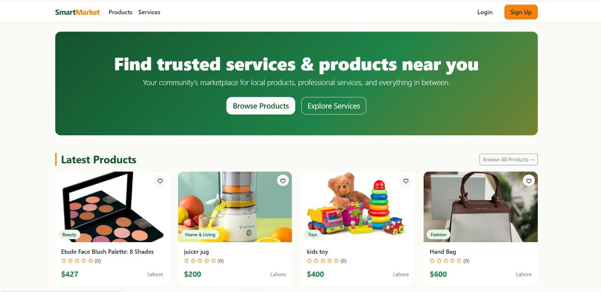
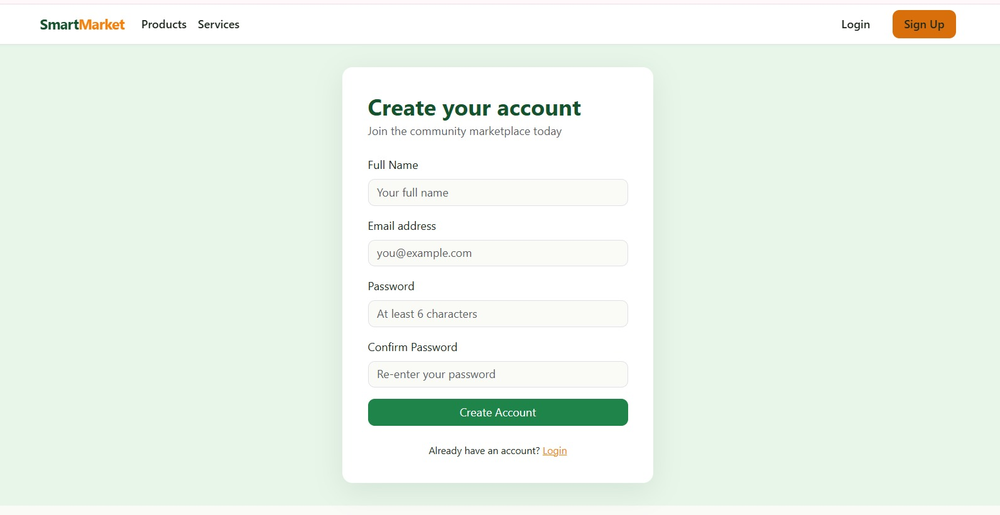
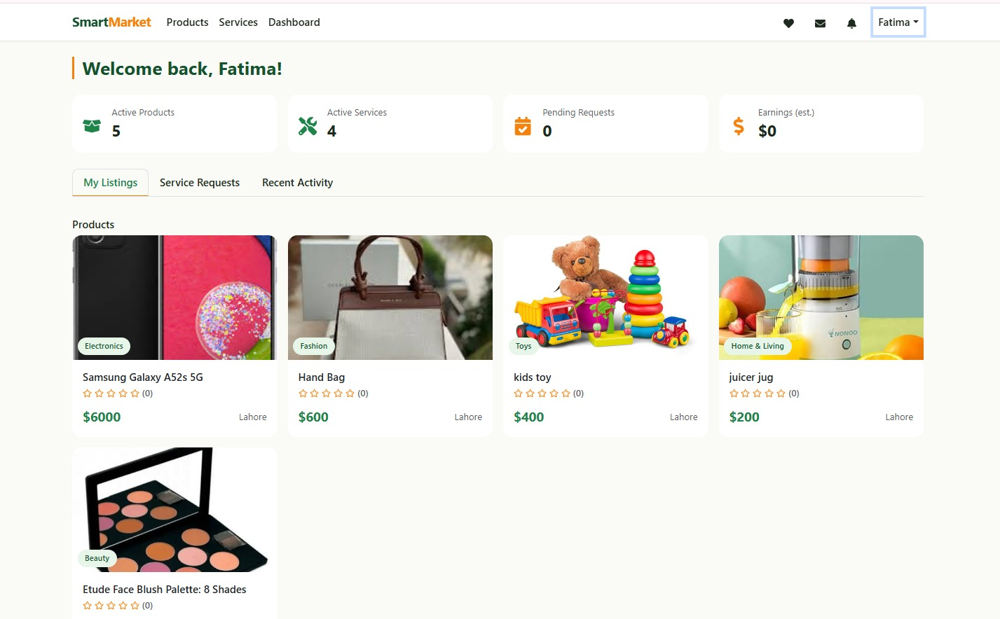
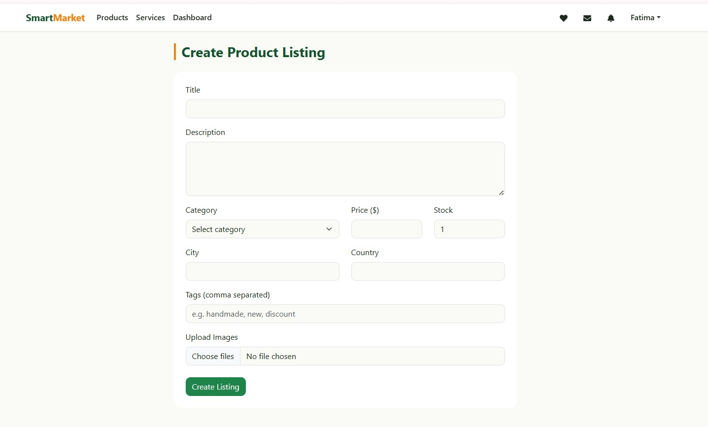
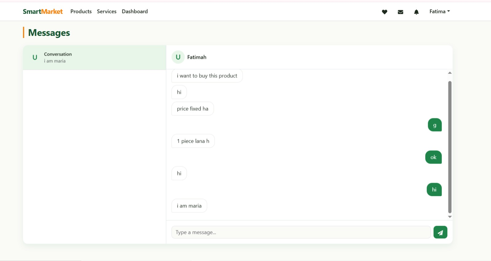

# 🛒 Smart Marketplace

A full-stack **MERN Marketplace** where users can buy and sell **products and services** using a single account. Instead of a traditional cart-and-checkout flow, buyers communicate directly with sellers through real-time chat, negotiate offers, and finalize deals—similar to OLX.

Built with modern web technologies, the platform provides a secure, responsive, and user-friendly experience for both buyers and sellers.

---

## 🚀 Live Demo

🔗 https://smart-marketplace-navy.vercel.app

> **Note:** The backend is hosted on a free server. The first request may take a few moments to respond if the server is waking up from sleep mode.

---

## ✨ Features

### 🔐 Authentication
- Secure JWT Authentication
- User Registration & Login
- Protected Routes
- Profile Management

### 🛍 Marketplace
- Buy & Sell Products
- Offer & Browse Services
- Single Account for Buyers & Sellers
- Search & Browse Listings

### 💬 Real-Time Chat
- Instant Buyer & Seller Messaging
- Socket.io Integration
- Offer Negotiation
- Accept / Reject Offers

### ⭐ Reviews & Ratings
- User Reviews
- Seller Ratings
- Buyer Ratings
- Community Trust System

### 📊 Dashboard
- Manage Listings
- Track Messages
- View Offers
- Edit Profile

### 📱 Responsive Design
- Mobile Friendly
- Responsive Layout
- Modern UI

---

## 🛠 Tech Stack

### Frontend
- React.js
- React Router
- Bootstrap
- Axios

### Backend
- Node.js
- Express.js
- MongoDB
- JWT Authentication
- Socket.io

---

## 📸 Screenshots

> Add your screenshots below.

### Hero Page



### Home 


### Registration Page 



### Dashboard



### Products



### Chat




---

## 📂 Project Structure

```
smart-marketplace
│
├── frontend
│
├── backend
│
└── package.json
```

---

## ⚙️ Installation

### Clone Repository

```bash
git clone https://github.com/fatimahamir/smart-marketplace.git
```

### Install Dependencies

#### Frontend

```bash
cd frontend
npm install
npm run dev
```

#### Backend

```bash
cd backend
npm install
npm run dev
```

---

## 🔑 Environment Variables

Create a `.env` file inside the backend folder.

```env
PORT=
MONGO_URI=
JWT_SECRET=
CLOUDINARY_CLOUD_NAME=
CLOUDINARY_API_KEY=
CLOUDINARY_API_SECRET=
CLIENT_URL=
```

---

## 💡 Future Improvements

- 🔔 Notifications
- ❤️ Wishlist
- 💳 Payment Integration
- 📍 Location-based Search
- 🤖 AI Recommendations

---

## 👩‍💻 Developer

**Fatima Amir**

- GitHub: https://github.com/fatimahamir
- LinkedIn: https://www.linkedin.com/in/YOUR-LINKEDIN-USERNAME/
  
---

## 📄 License

This project is developed for learning and portfolio purposes.
